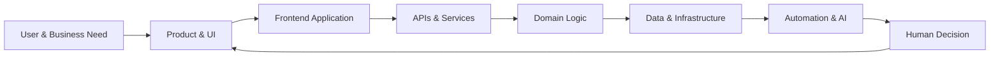

<div align="center">

<a href="https://github.com/Selaseyjr">
  
</a>

<br>

<p>
  <a href="https://github.com/Selaseyjr">
    
  </a>
  <a href="https://www.linkedin.com/in/selasey-junior-36250425a/">
    
  </a>
  <a href="https://adensadigital.com/">
    
  </a>
  <a href="https://logillm-logistics-planning.vercel.app/">
    
  </a>
</p>

<br>

### Software Engineer · Full-Stack Development · Frontend & UI

**I build software products that turn complex processes into clear, usable and connected digital systems.**

</div>

---

## About

I am a **software engineer focused on building digital products and integrated software systems**, with a strong frontend foundation and growing depth across backend engineering, APIs, databases and cloud infrastructure.

My work combines:

* **Frontend engineering** — responsive interfaces, interaction design and product-focused UI
* **Full-stack development** — connecting frontend applications with backend services and databases
* **Software architecture** — structured application layers, domain logic and maintainable systems
* **APIs & integration** — connecting applications, services and business processes
* **Data & backend engineering** — Python, FastAPI, SQL and PostgreSQL
* **Cloud & deployment** — production-oriented applications and cloud infrastructure
* **AI-enabled software** — decision support, workflow automation and human-in-the-loop systems

My domain experience in **business operations and supply-chain processes** gives me a practical environment in which to apply these engineering skills, but my interests extend beyond a single industry.

---

## The Way I Build



I am particularly interested in the space where **good software engineering meets good product design**.

A technically capable system is not enough.

The interface should make the system understandable.
The architecture should make it maintainable.
The workflow should make it useful.
And automation should support people rather than obscure how decisions are made.

---

## Selected Work

<table>
<tr>
<td width="50%" valign="top">

### <a href="https://adensadigital.com/">Adensa Digital</a>

**Full-Stack Operations Platform**

A production-oriented software product for operational visibility, exception investigation and recovery workflows.

**Engineering**

`Next.js` `TypeScript` `Python`
`FastAPI` `PostgreSQL` `Google Cloud`

**Focus**

Full-stack architecture · APIs · domain logic · data workflows · testing · cloud deployment · human-in-the-loop decision support

<br>

<a href="https://adensadigital.com/"><strong>Live Product →</strong></a> <a href="https://github.com/Selaseyjr/adensa-digital">Repository →</a>

</td>

<td width="50%" valign="top">

### <a href="https://logillm-logistics-planning.vercel.app/">LogiLLM</a>

**Frontend & Product Interface**

A modern web application exploring how complex logistics decisions can be presented through a focused operational interface.

**Engineering**

`Next.js` `React` `TypeScript`
`Tailwind CSS` `Vercel`

**Focus**

Frontend engineering · UI architecture · responsive design · interaction patterns · operational workflows · product UX

<br>

<a href="https://logillm-logistics-planning.vercel.app/"><strong>Live Application →</strong></a> <a href="https://github.com/Selaseyjr/logillm-logistics-planning-prototype">Repository →</a>

</td>
</tr>
</table>

---

## Frontend & UI

I enjoy the part of software engineering where **technology becomes an experience**.

My frontend work focuses on building interfaces that are:

```text
Clear          → users understand what matters
Responsive     → layouts adapt naturally across devices
Structured     → information has a deliberate hierarchy
Interactive    → actions and feedback feel connected
Consistent     → components behave like one product
Purposeful     → visual design supports the workflow
```

### Frontend stack

<p>


</p>

---

## Full-Stack Engineering

I build across the application stack rather than treating the frontend as an isolated layer.

<table>
<tr>
<td align="center" width="25%">

### UI

React
Next.js
TypeScript
CSS

</td>
<td align="center" width="25%">

### Backend

Python
FastAPI
REST APIs
Domain Logic

</td>
<td align="center" width="25%">

### Data

SQL
PostgreSQL
SQLite
Data Workflows

</td>
<td align="center" width="25%">

### Infrastructure

Git
Docker
Google Cloud
Vercel

</td>
</tr>
</table>

---

## Engineering Interests

<table>
<tr>
<td width="33%" valign="top">

### Product Engineering

Building software around real user workflows rather than isolated technical demonstrations.

**Interested in**

* Product architecture
* UI systems
* Component design
* Responsive applications
* User workflows
* Software maintainability

</td>

<td width="33%" valign="top">

### Systems Engineering

Connecting the parts of an application into a coherent system.

**Interested in**

* REST APIs
* Backend services
* Databases
* Systems integration
* Domain-driven design
* Testing & reliability

</td>

<td width="33%" valign="top">

### Intelligent Software

Using automation and AI where they create measurable value.

**Interested in**

* Workflow automation
* AI applications
* Decision support
* Human-in-the-loop systems
* Agentic workflows
* Operational intelligence

</td>
</tr>
</table>

---

## Technical Toolkit

<p align="center">


</p>

---

## Experience That Shapes My Engineering

Before moving deeper into software engineering, I worked across **business operations, digital systems and customer-facing technology**.

### Software Development

**CorkPro Ghana Limited · 2020–2022**

Worked with the software team on the transition from manual sales processes to digital purchasing, developing frontend interfaces and supporting functional, regression, end-to-end and cross-browser testing with Selenium.

### Operational Systems

**Ghana Airports Company Limited · 2022–2023**

Worked with digital complaint-management workflows and operational case systems in a high-volume airport environment.

### Business & Data

**University of Ghana · BSc Administration**

Built foundations in business management, quantitative methods, economics and organisational processes.

### Data & Computing

**Ironhack · Data Analytics Bootcamp**

Developed practical experience with Python, SQL, statistics, data analysis and machine learning.

### Current Academic Path

**TU Darmstadt · MA Data & Discourse Studies**

Combining computational methods, data analysis and language technology with broader research in digital data.

---

## What I'm Building Toward

My long-term direction is **software engineering with depth across the product and systems stack**.

```text
                    SOFTWARE ENGINEERING
                            │
          ┌─────────────────┼─────────────────┐
          │                 │                 │
       FRONTEND          BACKEND          SYSTEMS
          │                 │                 │
      UI / UX             APIs          Integration
      React              Python          Data
      Next.js            FastAPI         Cloud
      TypeScript         PostgreSQL      Automation
          │                 │                 │
          └─────────────────┼─────────────────┘
                            │
                     INTELLIGENT SOFTWARE
                            │
                  AI · Automation · Agents
```

Supply-chain technology is currently an important domain through which I explore these ideas, particularly around **planning, operational visibility, exception management and decision support**.

The underlying engineering principles, however, are applicable far beyond supply chain.

---

## Currently Learning

<p align="center">

`Software Architecture` · `Cloud Engineering` · `API Design` · `Testing` · `System Integration` · `AI Applications`

</p>

I am particularly interested in becoming better at the engineering decisions behind software:

**How should a system be structured?**
**How should its components communicate?**
**How do you make a product reliable as it grows?**
**How can complex workflows become simple user experiences?**

---

## A Few Things I Care About

> **Good software should make complexity easier to understand, not simply hide it.**

I value:

* Clear architecture over unnecessary complexity
* Strong interfaces over feature overload
* Reusable systems over one-off solutions
* Explainable automation over black-box workflows
* Testing as part of engineering, not an afterthought
* Product usability alongside technical quality

---

<div align="center">

## Let's Build Something Useful.

<br>

<a href="https://adensadigital.com/">
  
</a>
&nbsp;
<a href="https://logillm-logistics-planning.vercel.app/">
  
</a>

<br><br>

<a href="https://www.linkedin.com/in/selasey-junior-36250425a/">LinkedIn</a>
  ·   <a href="mailto:selaseygbeddy@gmail.com">Email</a>
  ·   <a href="https://drive.google.com/file/d/1fQkb-jNIuNQ7j-qHs1DZfPOKj7Ob4qvA/view?usp=sharing">CV</a>

<br><br>

<sub>Software Engineering · Product Development · Systems · AI</sub>

</div>


