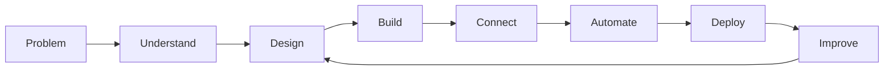

<div align="center">

<a href="https://github.com/Selaseyjr">
  
</a>

<br>

<p>
  <a href="https://github.com/Selaseyjr">
    
  </a>
  <a href="https://www.linkedin.com/in/selasey-junior-36250425a/">
    
  </a>
  <a href="https://adensadigital.com/">
    
  </a>
  <a href="https://logillm-logistics-planning.vercel.app/">
    
  </a>
  <a href="https://adensa-kitchen.vercel.app/">
    
  </a>
</p>

<br>

### Digital Product Builder · Frontend · Full-Stack · AI & Automation

**I turn business and user problems into clear, usable and connected digital products.**

</div>

---

## About

I build **digital products and software systems** from problem definition through design, development and deployment.

My work sits at the intersection of:

* **Product thinking** — understanding users, workflows and business needs
* **Frontend development** — responsive interfaces, interaction and accessibility
* **Full-stack development** — connecting applications, APIs, backend services and data
* **Data & automation** — turning operational information into useful workflows
* **AI-enabled products** — decision support, intelligent workflows and human-in-the-loop systems

My background in **business, data analytics and operations** gives me a practical perspective on how technology can improve the way people work.

I particularly enjoy taking something complex and turning it into a product that feels **clear, purposeful and easy to use**.

---

## How I Build



I don't see product design and software development as separate activities.

The strongest products connect:

**User need → Business process → Product experience → Technology → Outcome**

AI and automation can accelerate the work, but understanding **what should be built and why** remains fundamental.

---

## Selected Work

<table>
<tr>
<td width="50%" valign="top">

### <a href="https://adensadigital.com/">Adensa Digital</a>

**Digital Operations Platform**

An end-to-end product concept for improving operational visibility, exception management and recovery workflows.

`Next.js` `TypeScript` `Python`
`FastAPI` `PostgreSQL` `Google Cloud`

**Focus**

Product design · full-stack development · business workflows · APIs · data · automation · AI-assisted decision support

<br>

<a href="https://adensadigital.com/"><strong>Live Product →</strong></a> <a href="https://github.com/Selaseyjr/adensa-digital">Repository →</a>

</td>

<td width="50%" valign="top">

### <a href="https://logillm-logistics-planning.vercel.app/">LogiLLM</a>

**AI Logistics Decision Support**

A web application exploring how AI-assisted logistics decisions can be presented through a focused operational interface.

`Next.js` `React` `TypeScript`
`Tailwind CSS` `Vercel`

**Focus**

AI applications · frontend development · product UX · operational workflows · decision support

<br>

<a href="https://logillm-logistics-planning.vercel.app/"><strong>Live Application →</strong></a> <a href="https://github.com/Selaseyjr/logillm-logistics-planning-prototype">Repository →</a>

</td>
</tr>

<tr>
<td width="50%" valign="top">

### <a href="https://adensa-kitchen.vercel.app/">Adensa Kitchen</a>

**Digital Dining Experience**

A contemporary Ghanaian hospitality concept used to explore product interface design, responsive frontend development and polished digital experiences across desktop and mobile.

`React` `JavaScript` `Vite`
`Responsive UI` `Accessibility`

**Focus**

UI/UX · frontend development · interaction design · responsive interfaces · accessibility

<br>

<a href="https://adensa-kitchen.vercel.app/"><strong>Live Product →</strong></a> <a href="https://github.com/Selaseyjr/adensa-kitchen">Repository →</a>

</td>
</tr>
</table>

---

## Core Capabilities

<table>
<tr>
<td width="25%" align="center">

### Product

Problem Solving
User Workflows
Product Thinking
UX / UI

</td>

<td width="25%" align="center">

### Frontend

React
Next.js
JavaScript
TypeScript
Responsive UI

</td>

<td width="25%" align="center">

### Backend

Python
FastAPI
REST APIs
SQL
PostgreSQL

</td>

<td width="25%" align="center">

### Intelligent Systems

Automation
AI Applications
Decision Support
Agentic Workflows

</td>
</tr>
</table>

---

## Technology

<p align="center">


</p>

---

## What I Bring

```text
Business Understanding
        ↓
Problem Solving
        ↓
Product Thinking
        ↓
UX / Interface Design
        ↓
Frontend Development
        ↓
Backend & Data
        ↓
Automation & AI
        ↓
Working Product
```

My strength is not limited to one layer of a technology stack.

I can move between **the problem, the product and the technology**—understanding what needs to be solved, shaping the experience and contributing to the system that delivers it.

---

## Current Focus

I'm currently developing deeper capability across:

**Product Design · Frontend Engineering · Full-Stack Development · Digital Transformation · Workflow Automation · AI Applications**

My current domain focus is **digital supply chain and operational technology**, particularly around planning, visibility, exception management and decision support.

The underlying skills, however, extend beyond supply chain.

---

## Building With Purpose

> **Good technology should make complex work easier to understand and easier to do.**

I care about:

* Clear interfaces
* Practical solutions
* Maintainable systems
* Useful automation
* Human-centred AI
* Strong product decisions
* Software that solves real problems

---

<div align="center">

## Let's Build Something Useful.

<br>

<a href="https://adensadigital.com/">
  
</a>
&nbsp;
<a href="https://logillm-logistics-planning.vercel.app/">
  
</a>
&nbsp;
<a href="https://adensa-kitchen.vercel.app/">
  
</a>

<br><br>

<a href="https://www.linkedin.com/in/selasey-junior-36250425a/">LinkedIn</a>
  ·   <a href="mailto:selaseygbeddy@gmail.com">Email</a>
  ·   <a href="https://drive.google.com/file/d/1fQkb-jNIuNq7j-qHs1DZfPOKj7Ob4qvA/view?usp=sharing">CV</a>

<br><br>

<sub>Digital Products · Software · Data · Automation · AI</sub>

</div>


