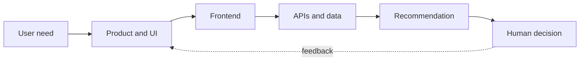

**I design and build software that helps people make better decisions.**

Darmstadt, Germany · M.A. student, TU Darmstadt · Available from November 2026

---

### How I build

A product mindset on top of full-stack engineering: from the first workflow sketch to a deployed, tested interface, designed so the system recommends and the person decides.

**Clear · Structured · Explainable · Consistent · Responsive · Purposeful**

---

### Selected work

| Project | Focus | Stack |
|:--|:--|:--|
| **[Adensa Digital](https://adensadigital.com)** Live · simulated data [Code](https://github.com/Selaseyjr/adensa-digital) | Supply-chain exception management with a human decision gate: detect, recommend, decide, execute, follow up. | `Next.js` `TypeScript` `FastAPI` `PostgreSQL` `Google Cloud` |
| **[Adensa Kitchen](https://adensa-kitchen.vercel.app)** Concept project | Responsive digital dining experience for a contemporary Ghanaian hospitality concept. | `React` `JavaScript` `Vite` |
| **[LogiLLM](https://logillm-logistics-planning.vercel.app)** Prototype · simulated data [Code](https://github.com/Selaseyjr/logillm-logistics-planning-prototype) | Logistics decision-support control tower: shipment intake, risk assessment and route options with emissions trade-offs. | `Next.js` `React` `TypeScript` `Tailwind CSS` |

---

### Toolkit

### Now

- **Adensa Digital:** reworking the work queue with feedback from two supply-chain operations professionals.
- **LogiLLM:** next up, CRUD and a real model integration.

<b>Background</b>

 

Business Administration at the University of Ghana, then software development at CorkPro Ghana (online catalogue, instant quotes and ordering, Selenium testing), IT applications at Ghana Airports Company, an Ironhack data analytics bootcamp, and now an M.A. in Data and Discourse Studies at TU Darmstadt.

---

> *Good software should make complexity easier to understand, not simply hide it.*

